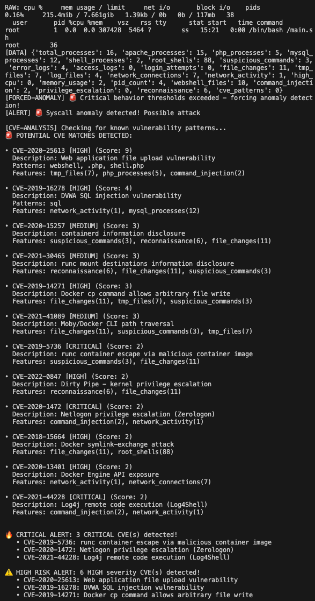
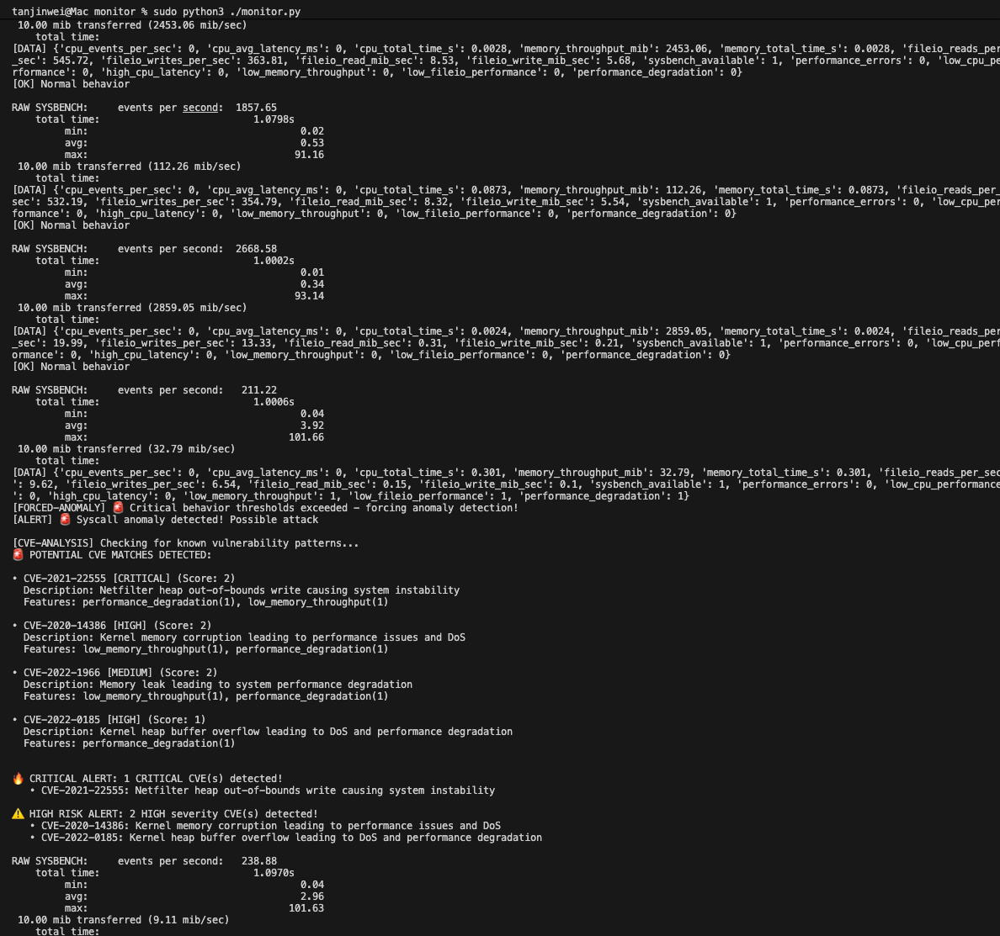

# Demo for ML anomaly detection - SYSBENCH version

## Alert Examples

### 🚨 Critical CVE Detection Alerts




*Real-time CVE correlation showing CRITICAL and HIGH severity vulnerability detection during container attack simulation.*

### 🔥 Sample Alert Output
```
[FORCED-ANOMALY] 🚨 Critical behavior thresholds exceeded - forcing anomaly detection!
[ALERT] 🚨 Syscall anomaly detected! Possible attack

🔥 CRITICAL ALERT: 2 CRITICAL CVE(s) detected!
   • CVE-2019-5736: runc container escape via malicious container image
   • CVE-2020-1472: Netlogon privilege escalation (Zerologon)

⚠️ HIGH RISK ALERT: 2 HIGH severity CVE(s) detected!
   • CVE-2020-25613: Web application file upload vulnerability
   • CVE-2019-16278: DVWA SQL injection vulnerability
```


## Commands

Set up and run clean docker image
```
docker-compose up --build
```

Run Anomaly Detection Monitor for training and start detection
```
cd monitor
python3 monitor.py

```

Attack Docker
```
cd attack
./trigger_anomalies.sh

```

## sysbench monitoring
```
cd container_cggroup_escape_exploitation/attacks/case1_exception_handling
docker compose up

cd Demo/monitor
sudo python3 ./monitor.py

cd Demo/attack
./trigger_attacks.sh
```